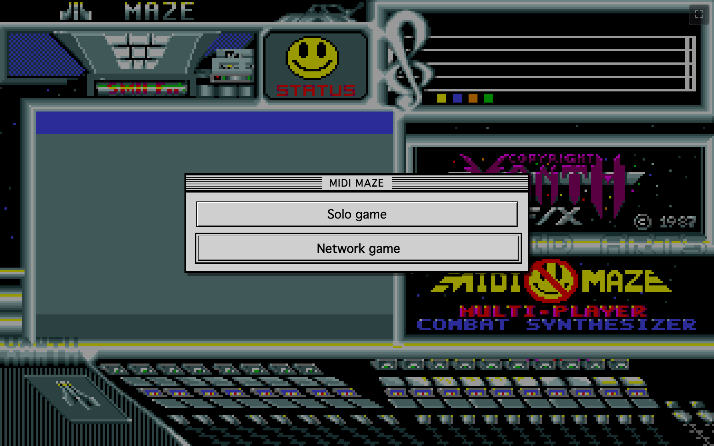
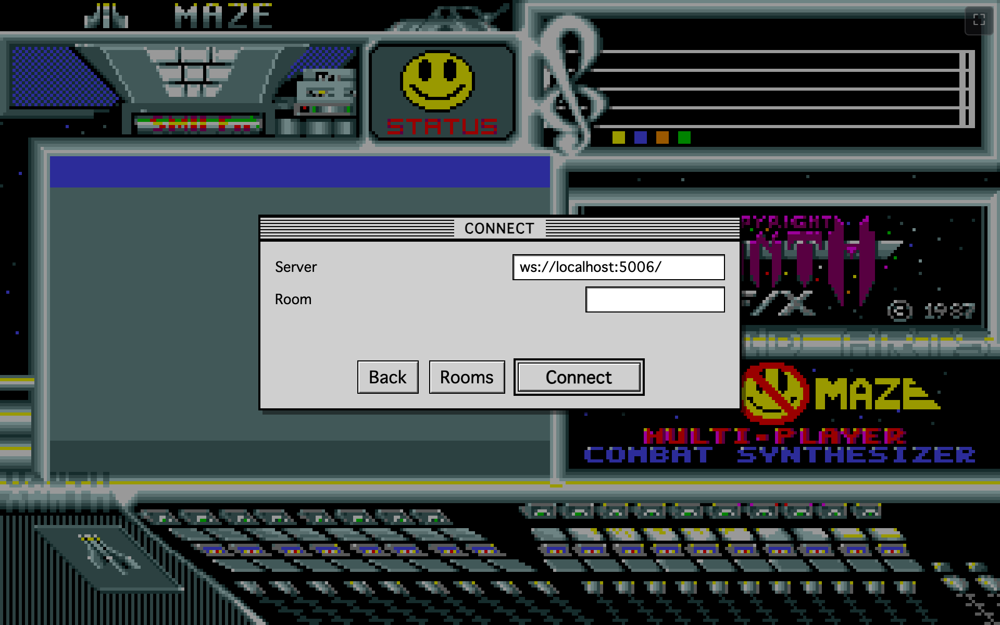
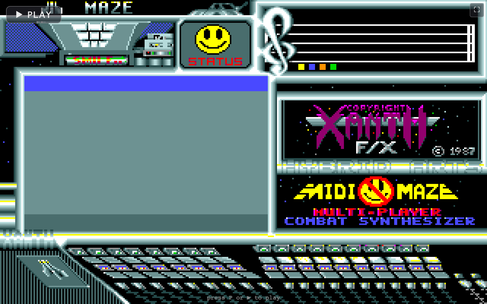
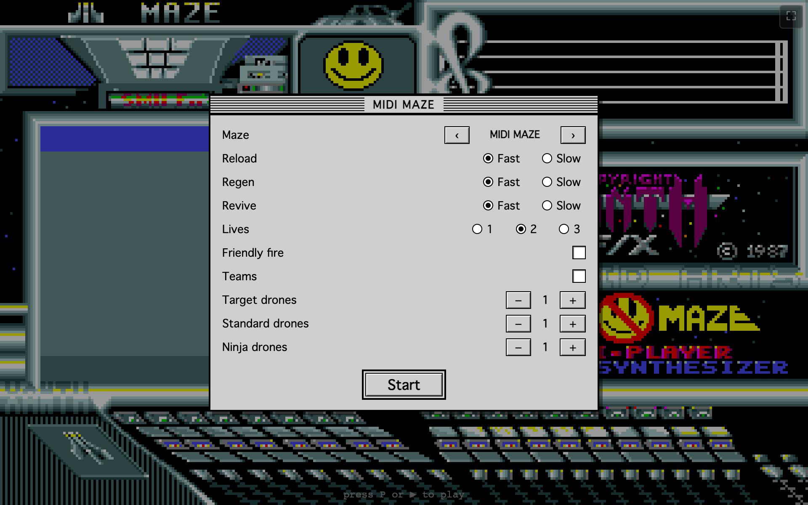
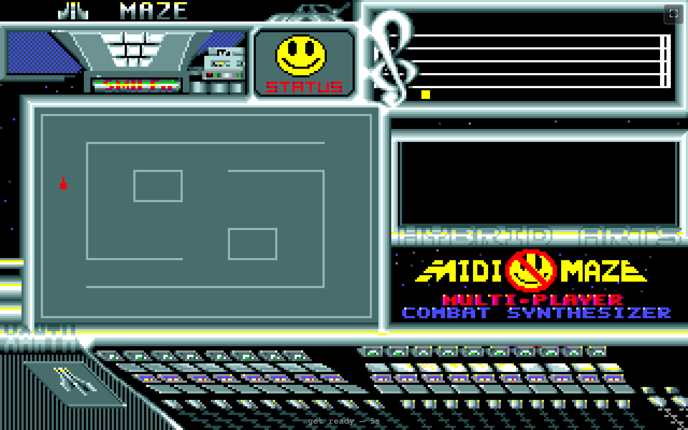
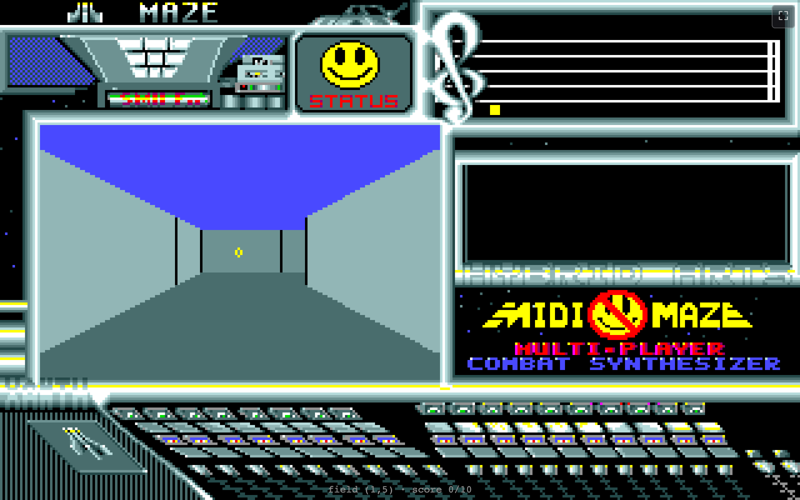
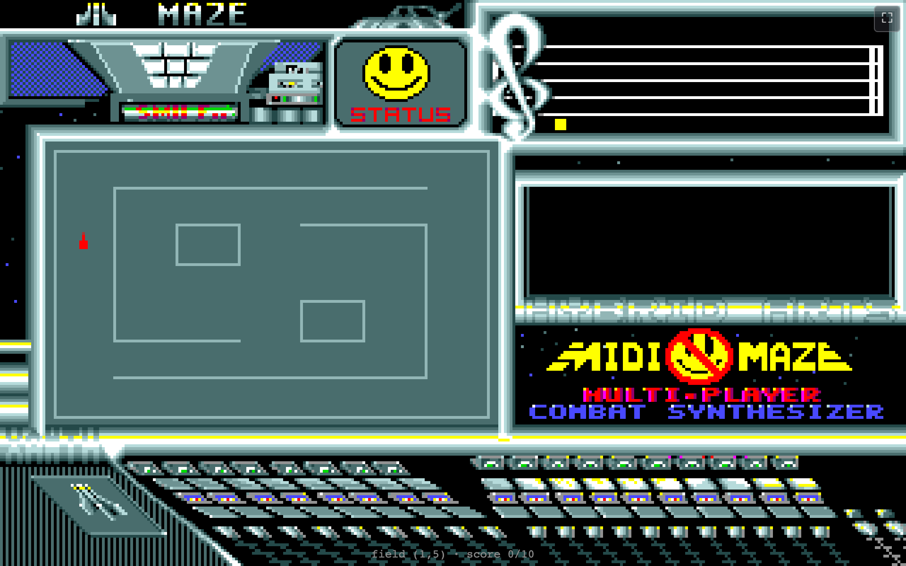
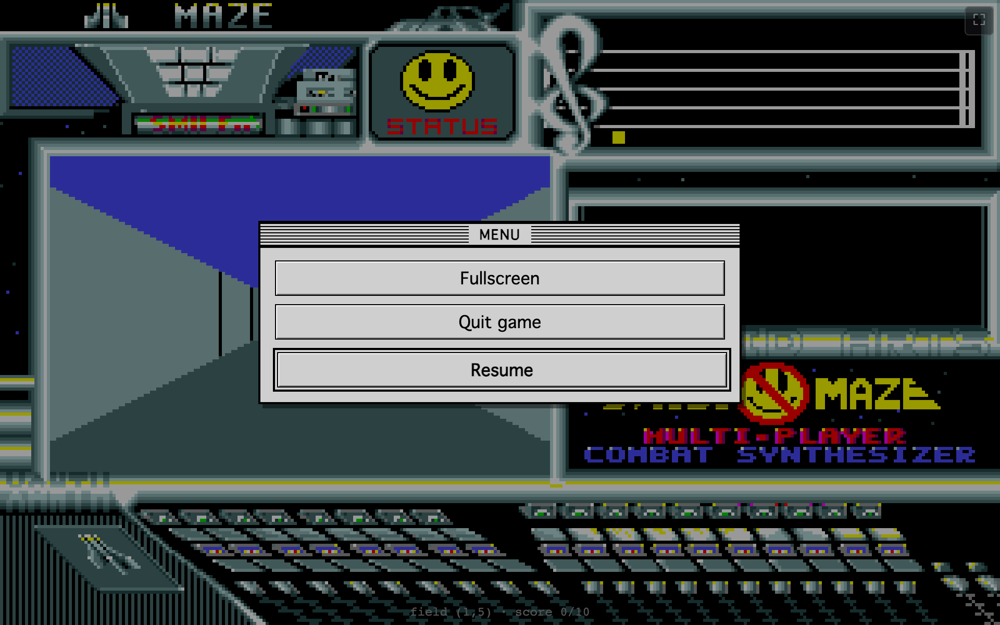
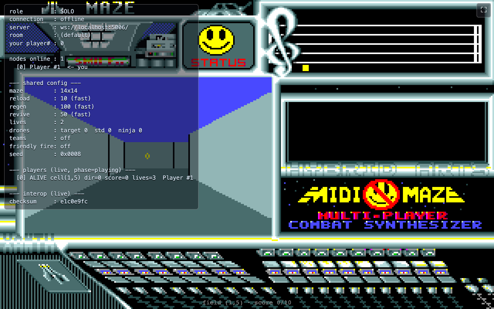

# midi-maze-js

A wire-faithful, browser-based re-creation of the Atari ST game **MIDI Maze**,
ported from the reconstructed C source:
https://github.com/sarnau/AtariST-MIDIMaze-Source

The goal is to play MIDI Maze in a mobile/desktop browser and — over a WebSocket
link to the [`md-MIDI2IP`](https://github.com/diegoparrilla/md-MIDI2IP) ring
orchestrator — share a ring with real Atari STs.

## Building

Requires Node 20+.

```sh
npm install      # install dependencies
npm run dev      # start the Vite dev server (open the printed URL)
npm run build    # type-check + produce a static bundle in dist/
npm run preview  # serve the built bundle locally
npm test         # run the Vitest suite once
npm run lint     # eslint + prettier --check
```

The build output in `dist/` is a self-contained static page (HTML + hashed JS/CSS
assets), launchable from any browser.

## Deploying a build

`dist/` is plain static files — host them on any static HTTP server (an S3 website
bucket, nginx, GitHub Pages, a CDN, or just `npm run preview`). `vite.config.ts` uses
`base: './'` (relative asset paths), so it works from any path or domain unchanged.

> **HTTP vs HTTPS matters for networked play.** A browser refuses an insecure `ws://`
> WebSocket from an HTTPS page (mixed content), and a public HTTPS page is also blocked
> from reaching a `localhost`/LAN orchestrator (Private Network Access). So to connect to
> a **local or LAN** `ws://` orchestrator, serve the page over **plain HTTP** on the same
> network. A **public** orchestrator (reachable by hostname) works from an HTTP page
> anywhere. Solo play has no such constraint.

## How to play

### 1. Choose a mode

On load you pick **Solo** (play against drones, offline) or **Network** (join a ring
through the orchestrator).



### 2. (Network) Connect to a room

For a network game, enter the orchestrator **Server** (`ws://…`) and an optional
**Room** key, or press **Rooms** to list the active rooms and pick one. **Connect** holds
the link open; an indicator by the fullscreen button shows the connection state.



### 3. Ready screen — press P / ▶

Like the original, the game waits on a main screen until you start it. Press **P** (or the
**▶** button, where the map button sits on the dashboard). In a network game this is where
the master is elected (MASTER / SLAVE) before the lobby opens.



### 4. Set up the game (preferences)

The lobby configures the round: **Maze**, **Reload** / **Regen** / **Revive** speed,
**Lives**, **Friendly fire**, **Teams**, and the number of **Target / Standard / Ninja
drones**. In a network game the master sets these for everyone. Press **Start**.



### 5. Map preview

Every round opens with a ~5-second overhead look at the maze so you can get your bearings.



### 6. Play

The first-person view fills the dashboard window: blue sky, grey floor, and the maze
corridors in perspective. The HUD shows the **crosshair** (when your shot is reloaded), the
**health face**, the **scoreboard** (each player's kills climbing the staff), and the
**kills window** (a dead face per drone/player you've taken out). Move and turn with the
arrow keys; fire with the space bar.



### 7. Overhead map (M)

Press **M** for a 2D overhead map of the maze with your position marked.



### 8. Pause menu (Esc)

**Esc** opens the menu — go fullscreen, quit the game, or resume.



### 9. Debug / interop overlay (D)

Press **D** for a transparent diagnostics overlay: role, connection, the shared game
config, live player state, and the per-tick **interop checksum** + joystick ring used to
spot desync against another node. Press **D** again to hide it.



### End of a round

When a player (or team) reaches the win score, the winner's face turns around and blinks,
or the loser's face shakes and sticks out its tongue — then the round returns to the ready
screen for another game.

## Controls

| Action | Keyboard | Touch |
| --- | --- | --- |
| Move forward / back | ↑ / ↓ | D-pad up / down |
| Turn left / right | ← / → | D-pad left / right |
| Fire | Space | Fire button |
| Start game (from ready) | P | ▶ button |
| Overhead map | M | — |
| Pause menu | Esc | Menu button |
| Fullscreen | F | Fullscreen button |
| Debug overlay | D | — |
| Edit names (network) | N | Names button |

## Regenerating the screenshots

The images above are captured from the built app by a Playwright script driving the solo
flow in a real browser:

```sh
npm run build
npm run preview          # in one shell (serves http://localhost:4173/)
npm run shots            # in another — writes docs/images/*.png
```

Re-run it after UI changes. It uses the system Chrome via `playwright-core` (no browser
download); the first-person frame rotates until a corridor is in view, so it's robust to
the per-round spawn.

## Plan & status

Work is organised as iterations → epics → stories → tasks under
[`docs/epics/`](docs/epics/). Start with
[`docs/epics/ITERATIONS.md`](docs/epics/ITERATIONS.md) and
[`docs/epics/DECISIONS.md`](docs/epics/DECISIONS.md). Regenerate the dashboard with
`./docs/epics/cockpit.sh` (writes `docs/epics/STATUS.md` — do not edit by hand).

The authoritative reference for game behaviour, file formats, and the MIDI protocol
is the reconstructed C in the sarnau repo above (the original game loads `.MAZ`
ASCII mazes; `.MZE` is MIDI Maze 2 and is not used here).
